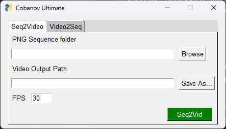

# Seq2Vid Conversion Tool



This script provides a graphical user interface (GUI) for converting between a PNG sequence and a video file. It utilizes the PySimpleGUI library for creating the GUI and the seq2vid module from the utils package for the actual conversion.

## Installation

```bash
## Optional
# python -m venv venv

pip install -r requirements.txt
```

```
python app.py
```

## Usage

1. Run the script using a Python interpreter.
2. The script will open a window titled "Cobanov Ultimate" with two tabs: "Seq2Video" and "Video2Seq".
3. Select the "Seq2Video" tab to convert a PNG sequence to a video file, or select the "Video2Seq" tab to convert a video file to a PNG sequence.
4. On the "Seq2Video" tab:
    - Enter the path to the folder containing the PNG sequence in the "PNG Sequence folder" input field.
    - Specify the output path for the video file in the "Video Output Path" input field.
    - Adjust the frames per second (FPS) for the output video using the "FPS" input field (default is 30 FPS).
    - Click the "Seq2Vid" button to start the conversion process.
5. On the "Video2Seq" tab:
    - Enter the path to the video file in the "Video Input" input field.
    - Specify the output folder for the PNG sequence in the "Sequence Output Folder" input field.
    - Adjust the frames per second (FPS) for the output PNG sequence using the "FPS" input field (default is 30 FPS).
    - Click the "Vid2Seq" button to start the conversion process.
6. A confirmation window will appear when the conversion is completed.

## Notes

If a file with the same name already exists at the destination during the Seq2Vid conversion, a confirmation window will prompt for overwriting.

The script will continue running until the window is closed.

## License

This script is released under the MIT License.
